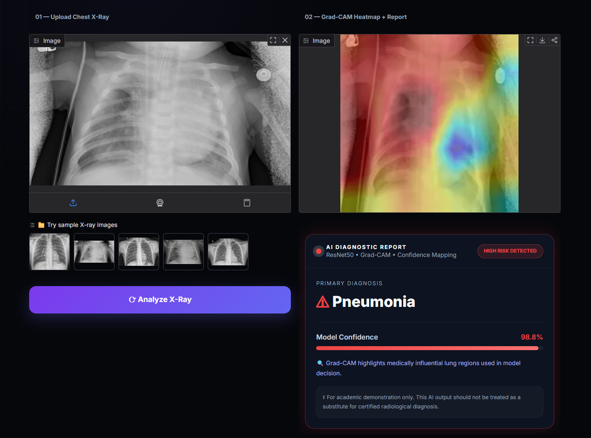

<div align="center">

# 🩻 PneumoScan AI
### Chest X-Ray Pneumonia Detection using Deep Learning

[](https://vivekp9508-chest-xray-pneumonia-detection.hf.space)
[](https://python.org)
[](https://tensorflow.org)
[](https://gradio.app)
[](LICENSE)

> **AI-powered medical imaging tool** that detects pneumonia from chest X-ray scans using a fine-tuned ResNet50 model with Grad-CAM explainability — deployed and accessible in real-time.

</div>

---

## 🔗 Live Demo

**Try it now →** [https://vivekp9508-chest-xray-pneumonia-detection.hf.space](https://vivekp9508-chest-xray-pneumonia-detection.hf.space)

No setup required. Upload any chest X-ray and get an instant AI-generated diagnosis with a visual heatmap — directly in your browser.

---

## 📸 Screenshots

**Landing Page**


**Upload Interface — with sample X-rays**


**AI Result — Grad-CAM Heatmap + Diagnostic Report**



**How The System Works**


---

## ✨ Features

| Feature | Description |
|---|---|
| 🖼️ **X-Ray Upload** | Accepts PNG/JPEG chest radiograph images |
| 🧠 **AI Prediction** | Classifies scan as **Normal** or **Pneumonia** |
| 📊 **Confidence Score** | Outputs model confidence percentage for transparency |
| 🔥 **Grad-CAM Heatmap** | Highlights infected lung regions for explainability |
| 🗂️ **Sample X-Rays** | 5 built-in sample images to try instantly |
| ⚡ **Real-Time Inference** | Instant results via a deployed Gradio web interface |
| 🌐 **No Setup Needed** | Fully accessible online — no install required |

---

## 🏗️ How It Works

```
📤 Upload X-Ray  →  ⚙️ Preprocess  →  🧠 ResNet50 Inference  →  🔍 Grad-CAM  →  📋 Report
```

1. **Preprocess** — Resize to 224×224, apply ImageNet normalization
2. **Inference** — Fine-tuned ResNet50 classifies the scan
3. **Classify** — Outputs `Normal` or `Pneumonia` label
4. **Confidence** — Returns probability score for the prediction
5. **Explainability** — Grad-CAM generates a heatmap over disease-influencing regions
6. **Display** — All results rendered in an interactive Gradio interface

---

## 🧠 Model Architecture

- **Base Model:** ResNet50 (pretrained on ImageNet)
- **Transfer Learning:** Top layers fine-tuned on chest X-ray dataset
- **Input Shape:** `224 × 224 × 3`
- **Output:** Binary classification — `Normal` / `Pneumonia`
- **Explainability:** Gradient-weighted Class Activation Mapping (Grad-CAM)

---

## 📦 Dataset

- **Name:** [Chest X-Ray Images (Pneumonia)](https://www.kaggle.com/datasets/paultimothymooney/chest-xray-pneumonia)
- **Source:** Kaggle — curated by Paul Mooney
- **Origin:** Guangzhou Women and Children's Medical Center, China
- **Total Images:** 5,863 chest X-ray images (JPEG)
- **Classes:** `Normal` (1,341 images) · `Pneumonia` (3,875 images)
- **Split:** Train / Validation / Test

> All images were screened and graded by expert physicians before being cleared for AI training. Low-quality or unreadable scans were removed from the dataset.

---

## 🛠️ Tech Stack

| Category | Technology |
|---|---|
| **Language** | Python 3.8+ |
| **Deep Learning** | TensorFlow / Keras |
| **Model** | ResNet50 (Transfer Learning) |
| **Explainability** | Grad-CAM |
| **Image Processing** | OpenCV, NumPy |
| **Web Interface** | Gradio |
| **Deployment** | Hugging Face Spaces |

---

## 📁 Project Structure

```
Chest-Xray-Pneumonia-Detection/
│
├── app.py                        # Gradio app — UI and inference pipeline
├── utils.py                      # Preprocessing, Grad-CAM, helper functions
├── requirements.txt              # Python dependencies
├── resnet_pneumonia_finetuned.keras  # Trained model weights
│
├── X-ray samples/                # Built-in sample chest X-rays
│   ├── sample1.jpeg
│   ├── sample2.jpeg
│   ├── sample3.jpeg
│   ├── sample4.jpeg
│   └── sample5.jpeg
│
├── screenshots/                  # App UI screenshots
│   ├── Landing page.png
│   ├── Upload Interface.png
│   ├── Result.png
│   └── How It Works.png
│
└── README.md
```

---

## ⚙️ Local Installation

> **Or just use the [live demo](https://vivekp9508-chest-xray-pneumonia-detection.hf.space) — no setup needed!**

**1. Clone the repository**
```bash
git clone https://github.com/vivekp9508/Chest-Xray-Pneumonia-Detection.git
cd Chest-Xray-Pneumonia-Detection
```

**2. Install dependencies**
```bash
pip install -r requirements.txt
```

**3. Run the application**
```bash
python app.py
```

The app will launch at `http://localhost:7860` in your browser.

---

## 🚀 Deployment

The project is deployed on **Hugging Face Spaces** using Gradio, making it publicly accessible with zero infrastructure management.

🔗 **Deployed at:** [https://vivekp9508-chest-xray-pneumonia-detection.hf.space](https://vivekp9508-chest-xray-pneumonia-detection.hf.space)

---

## 🔭 Future Scope

- [ ] Multi-disease detection (COVID-19, Tuberculosis, Pleural Effusion)
- [ ] PDF diagnostic report generation
- [ ] DICOM format support for clinical-grade input
- [ ] Medical dashboard integration for hospital workflows
- [ ] Model performance benchmarking with AUROC metrics

---

## 🙋 About the Author

**Vivek Pandey**

Built with a focus on Explainable AI (XAI) in medical imaging — making deep learning predictions interpretable and trustworthy for real-world healthcare contexts.

[](https://github.com/vivekp9508)

---
